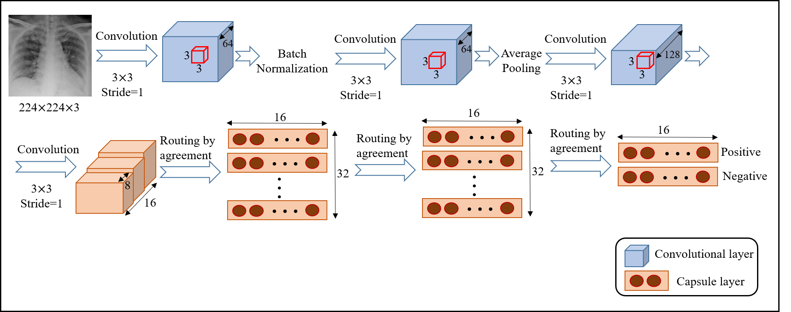

# COVID-CAPS
<h4> A Capsule Network-based framework for identification of  COVID-19 cases from chest X-ray Images </h4>

Novel Coronavirus disease 2019 pneumonia (COVID-19), with its relatively high intensive care unit (ICU) admission and mortality
rate, is rapidly spreading all over the world. Early diagnosis of this
disease is of paramount importance as it enables physicians to isolate
the patents and prevent the further transitions. The current gold standard
in COVID-19 diagnosis requires specific equipment, is timeconsuming,
and has relatively low sensitivity. Computed tomography
(CT) scans and X-ray images, on the other hand, reveal specific
manifestations associated with this disease. However, the overlap
between different bacterial and viral cases, makes the humancentered
diagnosis difficult and challenging.

The capsule network-based model (COVID-CAPS), proposed in this
study, for diagnosis of COVID-19, is capable of handling small
datasets, which is of significant importance as this disease has been
only recently identified and large datasets are not available.

So far, our results has shown that COVID-CAPS has competitive advantageous over
previous CNN-based models, on a public dataset of chest X-ray images. 
COVID-CAPS structure and methodology is explained in detail here: <a href="https://arxiv.org/abs/2004.02696">https://arxiv.org/abs/2004.02696</a> 

<h3>Note : Please don’t use COVID-CAPS as the self-diagnostic model without performing a clinical study.</h3>
  COVID-CAPS is currently a research model aiming to accelerate building a comprehensive and safe diagnostic system to identify COVID-19 cases. This model is not a replacement for clinical diagnostic tests and should not be used as a self-diagnosis tool to look for COVID-19 features without a clinical study at this stage. Our team is working on enhancing the performance and generalizing the model upon receiving more data from medical collaborators and scientific community. You can track new results and versions as they will be updated on this page. 

## Dataset
We used the same dataset as the one used <a href="https://github.com/lindawangg/COVID-Net">here.</a>
This dataset is generated from the following two publicly available chest
X-ray datasets.
* <a href="https://github.com/ieee8023/covid-chestxray-dataset">covid-chestxray-dataset</a> : A new data collection project to make COVID-19 data publicly available to the scientific community.
* <a href="https://www.kaggle.com/c/rsna-pneumonia-detection-challenge">RSNA Pneumonia Detection Challenge</a> : The dataset used in the Pneumonia Detection Challenge organized by the Radiological Society of North America.

As the main goal of this study is to identify
positive COVID-19 cases, we binarized the labels as either positive
or negative. In other words the three labels of normal, bacterial, and
non-COVID viral together form the negative class.

## Requirements
* Tested with tensorflow-gpu 2 and keras-gpu 2.2.4
* Python 3.6

## Code
The code for the Capsule Network implementation is adapted from <a href="https://keras.io/examples/cifar10_cnn_capsule/">here.</a>
Codes are available as the following list:
* binary.py : Main code
* test_binary.py : Test and Evaluation
* weights-improvement-binary-86.h5 : Best model's weights
